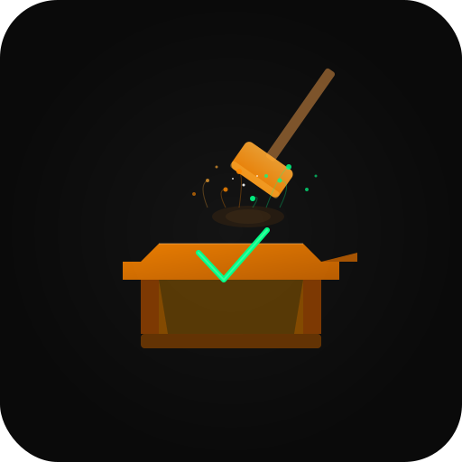

<div align="center">
  
  <h1>evalforge</h1>
  <p><strong>Agent evaluation harness — repeatable evals, regression detection, CI-ready</strong></p>

  [](https://github.com/speed785/evalforge/actions/workflows/ci.yml)
  [](https://codecov.io/gh/speed785/evalforge)
  [](https://pypi.org/project/evalforge/)
  [](https://www.npmjs.com/package/evalforge)
  [](https://python.org)
  [](https://typescriptlang.org)
  [](LICENSE)

  [Quick Start](#quick-start) · [Scoring Strategies](#scoring-strategies) · [CLI](#cli-usage) · [CI/CD](#cicd-integration) · [API Reference](#api-reference)
</div>

---

## Why evalforge?

Your agent passed QA last week. Today it's hallucinating. You have no idea when it broke.

evalforge gives you a test harness for agentic tasks: define cases once, run them on every deploy, and get an immediate diff when something regresses. It's provider-agnostic, has no hidden magic, and exits non-zero when your pass rate drops — so CI catches regressions before your users do.

- **7 scoring strategies** including semantic embeddings and LLM-as-judge
- **Regression tracking** across runs with automatic diff and webhook alerts
- **CLI-first** — `evalforge run evals.py` is all you need
- **Python + TypeScript** with identical APIs
- **100% test coverage** on the core library

---

## Quick Start

```bash
pip install "evalforge[all]"
```

```python
# evals.py
from evalforge.registry import registry
from evalforge import TestCase
from evalforge.scorer import fuzzy_match

@registry.suite("smoke")
def suite():
    return [TestCase(id="capitals", input="Capital of France?", expected_output="Paris", scoring=fuzzy_match(0.8))]

@registry.agent("my-agent")
async def agent(prompt): return "Paris"
```

```bash
evalforge run evals.py
# PASS  capitals  score=1.00  12ms
# Suite: smoke | 1/1 passed (100.0%)
```

That's it. One file, one command, one clear result.

---

## Features

| Feature | Details |
|---|---|
| Scoring strategies | 7: exact, fuzzy, contains, json_match, llm_judge, semantic, custom |
| Regression detection | Compares runs via JSONL history, surfaces newly-failing cases |
| Webhook alerts | POST to Slack or any endpoint when regressions are detected |
| Reports | Rich CLI table, JSON, self-contained HTML (dark theme) |
| Concurrency | Async runner with configurable parallelism and per-test timeouts |
| Observability | Structured JSON logs + Prometheus metrics export |
| Integrations | OpenAI and Anthropic agents + judge functions built-in |
| Registry | Name and reuse suites and agents across scripts |

---

## Scoring Strategies

| Strategy | When to use |
|---|---|
| `exact` | Deterministic outputs — IDs, codes, structured strings |
| `fuzzy` | Natural language where wording varies (uses rapidfuzz) |
| `contains` | Expected phrase must appear somewhere in the response |
| `json_match` | Deep-compare JSON structures, with optional key exclusions |
| `llm_judge` | Open-ended answers scored by a second LLM (0.0–1.0) |
| `semantic` | Embedding cosine similarity via `text-embedding-3-small` |
| `custom` | Bring your own `(expected, actual) -> float` function |

```python
from evalforge.scorer import (
    exact_match, fuzzy_match, contains_match,
    json_match, llm_judge, semantic_match, custom_scorer,
)

exact_match()                              # strict equality
fuzzy_match(threshold=0.8)                 # token similarity >= 80%
contains_match()                           # substring check
json_match(ignore_keys=["timestamp"])      # deep JSON compare
llm_judge(threshold=0.7)                   # LLM scores the answer
semantic_match(threshold=0.85)             # embedding cosine similarity
custom_scorer(lambda e, a: 1.0 if len(a) > 10 else 0.0)
```

---

## CLI Usage

```bash
# Run a suite
evalforge run evals.py
evalforge run evals.py --suite smoke --agent my-agent
evalforge run evals.py --tags geography,capitals --concurrency 4
evalforge run evals.py --output json > results.json
evalforge run evals.py --output html > report.html

# List registered suites and agents
evalforge list evals.py

# Compare the last two runs and detect regressions
evalforge compare eval_history.jsonl
evalforge compare eval_history.jsonl --suite smoke --output json
```

`evalforge run` exits with code `1` if any test fails — CI-friendly by default.

`evalforge compare` exits with code `1` if regressions are detected.

---

## Usage

### Python

```python
from evalforge import EvalHarness, TestCase
from evalforge.scorer import fuzzy_match, semantic_match

def my_agent(prompt: str) -> str:
    return "The capital of France is Paris."

harness = EvalHarness(
    agent=my_agent,
    suite_name="geo-smoke",
    history_path="eval_history.jsonl",   # enables regression tracking
    webhook_url="https://hooks.slack.com/...",  # optional regression alerts
)

harness.add(TestCase(
    id="france-capital",
    input="What is the capital of France?",
    expected_output="Paris",
    scoring=fuzzy_match(threshold=0.8),
    tags=["geography"],
))

result = harness.run(report_html="reports/run.html")
```

### TypeScript

```typescript
import { EvalHarness, TestCase } from "evalforge";
import { fuzzyMatch } from "evalforge/scorer";

const harness = new EvalHarness({
  agent: async (input) => "The capital of France is Paris.",
  suiteName: "geo-smoke",
  historyPath: "eval_history.jsonl",
});

harness.add(new TestCase({
  id: "france-capital",
  input: "What is the capital of France?",
  expectedOutput: "Paris",
  scoring: fuzzyMatch(0.8),
  tags: ["geography"],
}));

const result = await harness.run({ reportHtml: "reports/run.html" });
```

---

## Integrations

### OpenAI

```python
from evalforge.integrations.openai import OpenAIAgent, openai_judge_fn
from evalforge import EvalHarness
from evalforge.scorer import Scorer, llm_judge

agent  = OpenAIAgent(model="gpt-4o")
scorer = Scorer(llm_judge_fn=openai_judge_fn(model="gpt-4o-mini"))
harness = EvalHarness(agent=agent, suite_name="gpt4o-suite", scorer=scorer)
```

### Anthropic

```python
from evalforge.integrations.anthropic import AnthropicAgent, anthropic_judge_fn
from evalforge.scorer import Scorer

agent  = AnthropicAgent(model="claude-3-5-haiku-20241022")
scorer = Scorer(llm_judge_fn=anthropic_judge_fn())
harness = EvalHarness(agent=agent, suite_name="claude-suite", scorer=scorer)
```

---

## CI/CD Integration

Drop this into `.github/workflows/evals.yml` and your agent's pass rate becomes a required check:

```yaml
name: Evals

on:
  push:
    branches: [main]
  pull_request:

jobs:
  evals:
    runs-on: ubuntu-latest
    steps:
      - uses: actions/checkout@v4

      - uses: actions/setup-python@v5
        with:
          python-version: "3.12"

      - name: Install evalforge
        run: pip install "evalforge[all]"

      - name: Run eval suite
        env:
          OPENAI_API_KEY: ${{ secrets.OPENAI_API_KEY }}
        run: |
          evalforge run evals/suite.py \
            --output json > eval_results.json
          evalforge compare eval_history.jsonl

      - name: Upload eval report
        if: always()
        uses: actions/upload-artifact@v4
        with:
          name: eval-report
          path: eval_results.json
```

The `evalforge compare` step exits `1` if any previously-passing test now fails, blocking the merge.

---

## Regression Detection & Webhooks

Every run can append to a JSONL history file. `evalforge compare` diffs the last two runs and tells you exactly which cases regressed.

```python
harness = EvalHarness(
    agent=my_agent,
    suite_name="production-suite",
    history_path="eval_history.jsonl",
    webhook_url="https://hooks.slack.com/services/...",
)
result = harness.run()
# If any previously-passing test now fails:
# → regression logged to eval_history.jsonl
# → Slack webhook fires with suite name, failing cases, and pass rate
```

Or use the tracker directly:

```python
from evalforge.reporter import RegressionTracker

tracker = RegressionTracker("eval_history.jsonl")
regressions = tracker.compare_and_save(result)
# regressions: ["case-id-1", "case-id-2"]
```

Webhook payload is Slack-compatible (Block Kit) and also works with any HTTP endpoint that accepts JSON.

---

## API Reference

### `EvalHarness`

```python
EvalHarness(
    agent,                    # callable: (str) -> str | Awaitable[str]
    suite_name,               # str
    scorer=None,              # Scorer instance (default: Scorer())
    history_path=None,        # str — path to JSONL regression history
    webhook_url=None,         # str — POST target for regression alerts
    concurrency=1,            # int — parallel test execution
    default_timeout=30.0,     # float — per-test timeout in seconds
)

harness.add(test_case)        # add a TestCase
harness.run(
    report_html=None,         # str — path to write HTML report
    report_json=None,         # str — path to write JSON report
    verbose=True,             # bool — print rich table to terminal
)
```

### `TestCase`

```python
TestCase(
    id,                       # str — unique identifier
    input,                    # str — prompt sent to agent
    expected_output,          # Any — ground truth
    scoring,                  # ScoringCriteria from scorer helpers
    description=None,         # str — human-readable label
    tags=None,                # list[str] — for filtering
    timeout=None,             # float — overrides harness default
    metadata=None,            # dict — arbitrary extra data
)
```

### Registry

```python
from evalforge.registry import registry

@registry.suite("my-suite")
def suite(): return [TestCase(...)]

@registry.agent("my-agent")
async def agent(prompt): return "..."

result = await registry.run("my-suite", "my-agent")
```

---

## Contributing

PRs welcome. Open an issue first for large changes.

```bash
# Python dev setup
pip install -e "python/[all]"
cd python && pytest --cov=evalforge

# TypeScript dev setup
cd typescript && npm install && npm run build && npm test
```

---

## License

MIT — see [LICENSE](LICENSE).
